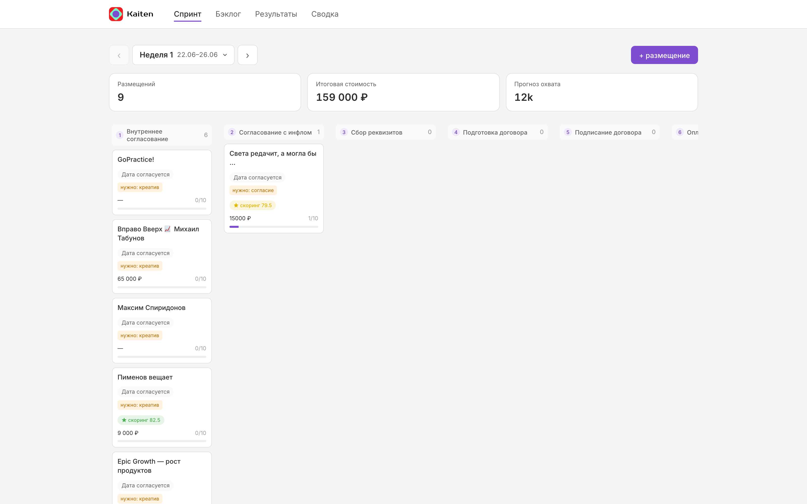
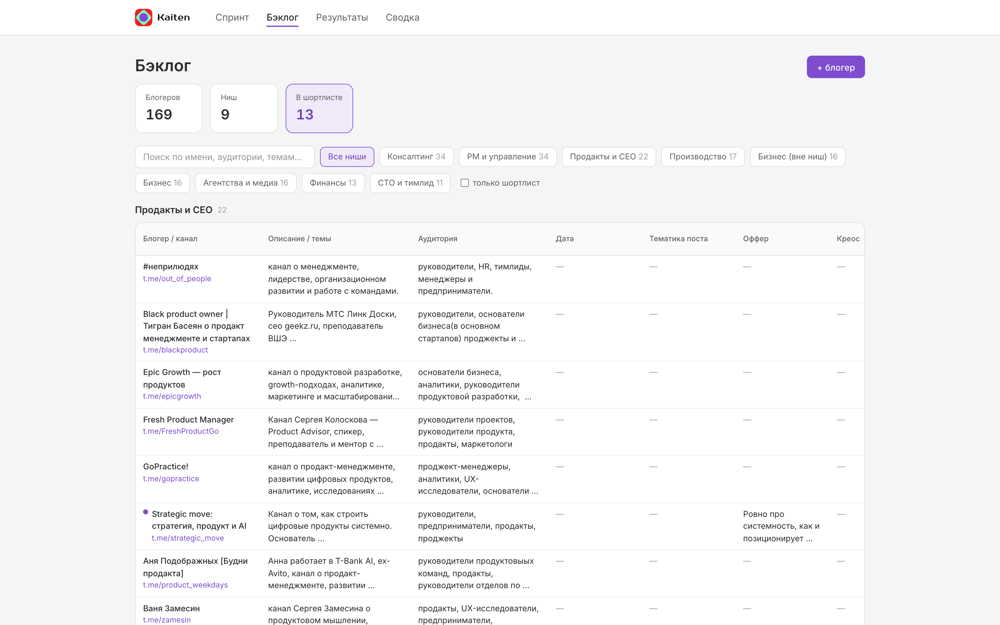
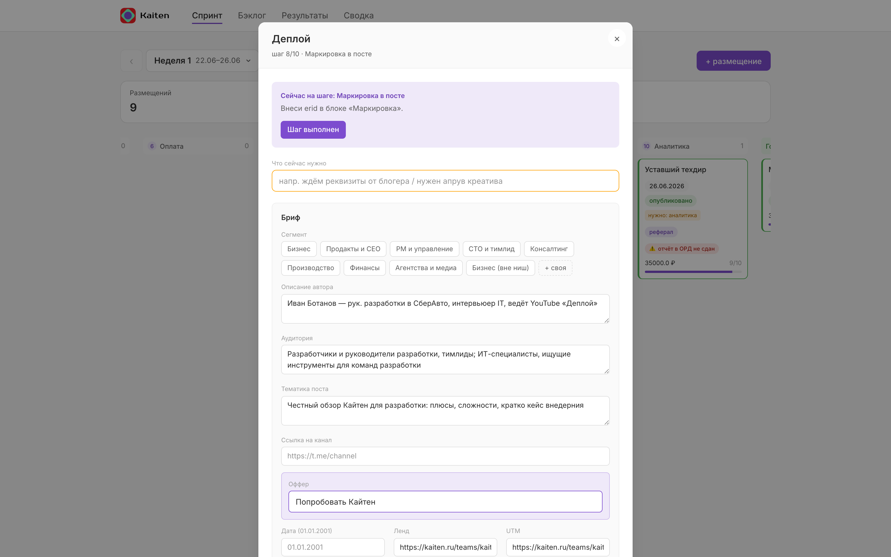
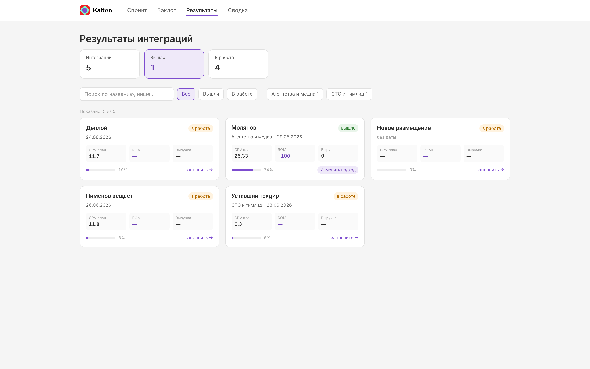
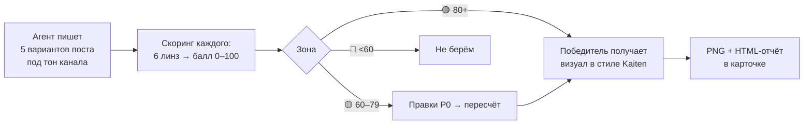
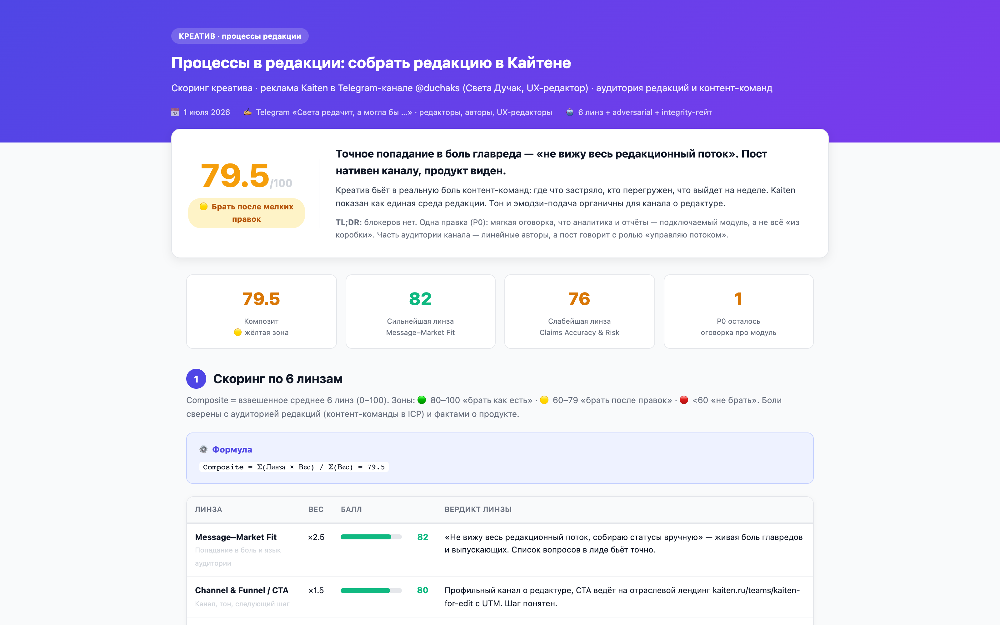
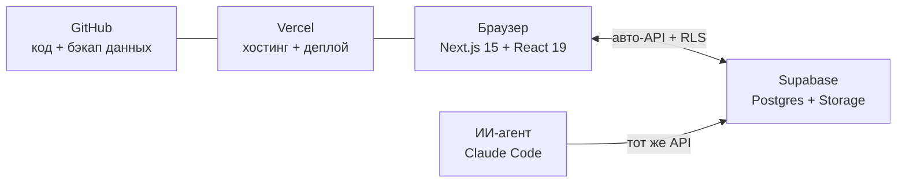

# Kaiten Influence · платформа инфлюенс-маркетинга

**Живой инструмент для управления посевами у блогеров**, собранный за 10 дней через
ИИ-агента. Не прототип — команда работает в нём каждый день: 9 размещений в текущем
спринте проходят весь путь от брифа до аналитики внутри платформы.

**Прод:** [kaiten-influence.vercel.app](https://kaiten-influence.vercel.app) ·
**Презентация-воркшоп:** [/workshop](https://kaiten-influence.vercel.app/workshop/) ·
**Как устроен скоринг:** [docs/SCORING.md](docs/SCORING.md)

Принцип: **один блогер — одна строка**. Бэклог и спринт — два вида одной таблицы,
а не копипаст между листами. Процесс, который раньше жил в таблицах, чатах
и чьей-то голове, собран в одну доску.

---

## Экраны

| | |
|---|---|
|  |  |
| **Спринт** `/sprint` — размещения недели: канбан по 10 этапам воронки, счётчики бюджета и прогноза охвата, на карточках — цена, бейдж скоринга, прогресс по шагам | **Бэклог** `/backlog` — 169 блогеров по нишам: исследование, экономика, шортлист, кнопка «→ в спринт» |
|  |  |
| **Карточка размещения** — все артефакты сделки: креативы с вариантами и скорингом, договор, оплата, маркировка (ERID), ссылки, комментарии команды | **Результаты** `/results` и **Сводка** `/analytics` — факт по вышедшим размещениям и экономика по всем неделям |

## Как устроена сделка: 10 этапов воронки

Каждое размещение — карточка, которая едет по колонкам: согласование креатива →
реквизиты → договор → оплата → маркировка → публикация → аналитика.
У каждого этапа — **обязательный артефакт** (файл креатива, номер договора,
токен ERID). Пока артефакт не внесён — карточка не едет дальше. Дисциплина
процесса встроена в интерфейс.

## Конвейер креативов и скоринг



Скоринг заменяет «нравится / не нравится» на измеримое решение: 6 взвешенных линз
(Message–Market Fit ×2.5 … Creative Craft ×1), разметка утверждений FACT/INF/RISK,
adversarial-проверка тремя «скептиками», integrity-гейт против фабрикации опыта
блогера. Каждый скоринг — самодостаточная HTML-страница-отчёт
([примеры](https://kaiten-influence.vercel.app/scoring/2026-week1-sveta-editorial.html)),
которую можно показать блогеру или руководителю.



**Подробно:**
- [docs/SCORING.md](docs/SCORING.md) — алгоритм целиком: формула, линзы, веса, гейты и процесс калибровки
- [docs/creative-diversity.md](docs/creative-diversity.md) — правило разнообразия сетов: 4 оси (угол, жанр, стиль под автора, фокус), пунктуационная гигиена, diversity-гейт до скоринга
- [docs/personas.md](docs/personas.md) — синтетическая панель ЦА: 8 портретов, которые «читают» каждый креатив и думают от первого лица; цели — убрать когнитивные искажения и сделать A/B-тесты дата-driven
- [docs/scoring-dataset.md](docs/scoring-dataset.md) — калибровочный датасет: реальные офферы Битрикс24, YouGile, Яндекс Трекера и Shtab (дословно с сайтов, с источниками), размеченные и оценённые, с уроками для рубрики
- [docs/scoring-dataset.json](docs/scoring-dataset.json) — тот же корпус машиночитаемо (few-shot для прогонов)

## Архитектура: своего бэкенда нет



- **Браузер ходит в базу напрямую.** Supabase превращает таблицы в API автоматически;
  безопасность — RLS (Row Level Security) + публичный ключ, безопасный by design.
  Цена решения: фичи за часы, ноль серверов, ноль рублей инфраструктуры.
- **Модель данных: жёсткий каркас + гибкий центр.** Обычные колонки — для фильтров
  и сумм (бюджет, охват). Одно поле `data jsonb` — для всего живого: варианты
  креативов, скоринг, голосовые, история правок. Фичи добавляются без миграций.
- **Совместные правки без затирания.** При записи — diff-патчи (уходят только
  изменённые поля), при чтении — лёгкий опрос раз в 12 секунд (0.7 КБ вместо
  60 КБ — в 85× меньше трафика, чем наивный полный опрос).
- **Работа через агента.** «Добавь размещение: канал такой-то, цена 15К, счёт из
  этого PDF, скоринг под аудиторию редакций» — агент создаёт карточку, прикладывает
  счёт, считает скоринг, вешает бейдж. Руками через интерфейс можно всё то же самое.

## Сервисы (всё на бесплатных тарифах)

| Сервис | Роль |
|---|---|
| Next.js + Tailwind | Интерфейс; дизайн-токены Kaiten v01 (из `ha1ex/site_zavod`) |
| Supabase | Postgres, авто-API, Storage для файлов |
| Vercel | Хостинг и деплой |
| GitHub | Код, история, бэкап данных |
| Claude Code | Агент: код, креативы, скоринг, операции с базой |
| Click.ru | Маркировка рекламы (ERID, отчёты в ОРД) |
| TGStat | Проверка каналов: охваты, вовлечённость, накрутки |

## Данные

Источник — выгрузка лонглиста из Excel. Импортёр нормализует 13 листов в чистый
датасет с дедупликацией по telegram-ссылке:

```bash
pnpm import          # data/channels.json + data/sprints.json из Excel
```

- `data/channels.json` — 169 блогеров: ниши, экономика, флаг шортлиста.
- `data/sprints.json` — спринты и размещения с пайплайном.

## Запуск

```bash
pnpm install
pnpm dev             # http://localhost:3007
```

## Деплой (через Vercel CLI)

GitHub-автодеплой не настроен — публикуем вручную через CLI.

Первый раз на машине:

```bash
npx vercel login     # вход в аккаунт (один раз)
npx vercel link      # привязать каталог к проекту kaiten-influence (один раз)
```

Каждый деплой свежего `main` на прод:

```bash
git pull
pnpm deploy          # = npx vercel --prod  → https://kaiten-influence.vercel.app
```

`public/scoring/*.html` и `public/workshop/` уходят в сборку и отдаются
по `/scoring/...` и `/workshop/`. После деплоя — проверить живой прод руками,
не верить зелёным галочкам в логах (см. слайд «четыре грабли» в воркшопе).

## Структура репозитория

```
app/                  # экраны: sprint, backlog, results, analytics + PasscodeGate
  api/contract/       # автосборка договора (шаблоны СМЗ / ИП-ООО)
lib/                  # типы данных, Supabase-клиенты, шаблоны договоров
data/                 # channels.json, sprints.json, integrations.json
docs/                 # SCORING.md, scoring-dataset.*, SUPABASE.md
public/scoring/       # HTML-отчёты скоринга креативов
public/workshop/      # презентация-воркшоп (19 слайдов) + речь спикера
scripts/              # импорт Excel, сборка шаблонов договоров, upsert креативов
supabase/             # схема и настройки базы
```

## Роадмап

1. ✅ Скелет + стиль Kaiten + импорт Excel.
2. ✅ Supabase: живые данные, файлы, совместные правки (diff-патчи + лёгкий опрос).
3. ✅ Конвейер креативов: 5 вариантов → скоринг 6 линз → визуал → PNG.
4. ✅ Договоры (СМЗ / ИП-ООО), счета, маркировка ERID в карточке.
5. ⬜ RLS-роли (admin / producer / researcher / viewer) + аудит изменений.
6. ⬜ Автоснятие аналитики по вышедшим постам (TGStat API).
