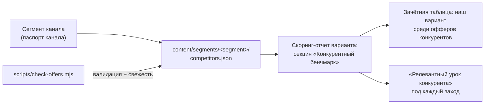

# Конкурентный бенчмарк: как работает и как собирать офферы

> Механизм посегментного сравнения наших креативов с реальными офферами
> конкурентов. Появился после вывода: «конкуренты всегда разные» — редакция
> сравнивает с Notion-заменами, разработка — с трекерами. Глобальный список
> конкурентов вводит в заблуждение.

## Как это работает



1. У каждого сегмента — свой файл конкурентов: `content/segments/<segment>/competitors.json`.
2. Каждый конкурент — **дословные цитаты оффера** с сайта (с URL и датой снятия),
   разметка FACT/INF/RISK, баллы по 6 линзам и composite **той же рубрикой
   и теми же весами**, что и наши креативы. Иначе сравнение нечестное.
3. Генератор отчёта берёт сегмент из паспорта канала и подтягивает его файл.
   В отчёте: зачётная таблица (наш вариант подсвечен) + релевантный урок
   конкурента для конкретного захода.
4. `scripts/check-offers.mjs` следит за корректностью и свежестью (ниже).

## Кого считать конкурентом сегмента

Правило: **не «наши конкуренты», а «с кем сравнивает читатель этого канала,
когда решает».** Проверка — вопрос персоны-ЛПР сегмента: «а чем это лучше X?»
Кто такой X в её устах, тот и в файле.

| Сегмент | X в устах читателя | В файле |
|---|---|---|
| editorial | «чем лучше Notion-замены для базы?» | Teamly, Yonote (+ WEEEK, TODO) |
| it-dev | «чем лучше трекера?» | Битрикс24, YouGile, Яндекс Трекер, Shtab |

3–5 конкурентов на сегмент. Больше — шум, меньше — не бенчмарк.

## Методика снятия оффера (чек-лист)

1. **Страницы:** главная + тарифная. Если есть сравнительная страница
   («мы vs Notion») — тоже: это их лучший аргумент.
2. **Цитировать дословно**, по-русски, без пересказа. Пересказ = наша
   интерпретация, спорить с ней бессмысленно.
3. **Фиксировать:** `source` (URL каждой страницы), `captured_at` (дата снятия).
4. **Размечать каждую цитату:** FACT (проверяемо) / INFERENCE (вывод) /
   RISK (усилитель без источника, неизмеримое обещание, правда по частям).
5. **Скорить той же рубрикой:** 6 линз × те же веса → composite. Оффер
   оценивается как рекламное сообщение, попавшее в ленту панели сегмента.
6. **Извлекать урок:** одна строка «что этот оффер учит наш креатив делать
   или не делать». Оффер без урока в файл не заносится.
7. Не оффер, а факты продукта (лимиты, цены) — при использовании в наших
   текстах **всегда сверять на дату публикации**, не на дату снятия.

## Свежесть и валидация: scripts/check-offers.mjs

```bash
node scripts/check-offers.mjs          # проверить все сегменты
```

Проверяет каждый `competitors.json`:
- **математика** — composite пересчитывается из линз и весов; расхождение
  больше 0.1 — ошибка (прецедент: ручные композиты уже расходились);
- **свежесть** — `captured_at` старше 30 дней → warning «пересобрать офферы»;
- **схема** — у каждого конкурента есть цитаты, source, lesson, зона
  соответствует composite;
- **покрытие** — у каждого сегмента из `content/segments/` есть файл
  конкурентов, у каждого канала из `content/channels/` — сегмент с файлом.

Запускать: перед каждым прогоном скоринга (этап 0, интейк) и после любого
редактирования файлов конкурентов.

## Цикл обновления

- **Раз в 30 дней** или перед крупной закупкой — переснять офферы сегмента:
  конкуренты меняют тарифы и слоганы.
- Старые снятия не удалять при смене оффера — заменить и записать
  прежнюю цитату в `history` с датами: динамика чужого позиционирования
  сама по себе инсайт («Teamly сменил "№1 в РФ" на … — значит, юристы дожали»).
- Новый сегмент = новый файл по методике выше + панель ЦА
  (см. инструкцию в panel.md сегмента).
