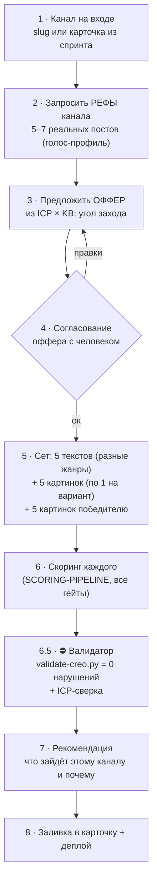

# Runbook: от канала до готового сета

> Операторский порядок работы (что за чем и где ставим человека в цикл).
> Движок скоринга — в [SCORING-PIPELINE.md](SCORING-PIPELINE.md), обвязка данных —
> в [PIPELINE.md](PIPELINE.md). Эталон тона — `content/references/creo-gold-standard.md`,
> ЦА — `content/references/icp-kaiten.md`.
>
> **Два обязательных согласования с человеком:** (1) рефы канала на входе,
> (2) оффер до генерации. Без них сет не запускаем.

## Поток

## Шаги

### 1 · Канал на входе
Приходит `slug` канала или карточка из спринта (Supabase `placements`). Завести/открыть
`content/channels/<slug>/` (channel.md, voice-profile.md).

### 2 · Запросить рефы канала  ⛔ гейт
**Всегда просить у человека 5–7 реальных постов канала** (или ссылку на канал для сбора).
Без них голос-профиль — гипотеза (помечать ⚠), voice-match считается против догадки.
Рефы кладём в `real-posts.md`, обновляем `voice-profile.md`.

### 3 · Предложить оффер
Из **ICP** (задетые сегменты/роли/боли) × **KB продукта** (какие модули реально закрывают боль)
сформулировать **конкретный угол захода**, а не «расскажем про Kaiten». Примеры углов:
- зайти через **готовые шаблоны** (Пространство HR, Найм, редакция…);
- **«Kaiten для HR / для редакций»** — сценарий под роль;
- **перенос процессов / миграция** (из Notion, зарубежного ПО);
- **аналитика/метрики потока** (накопительная диаграмма, SLA);
- **импортозамещение/суверенитет** (реестр, on-prem, данные в РФ);
- **экономика** (замена 3–4 подписок, бесплатный бессрочный тариф).

Дать 1–3 варианта оффера с обоснованием «почему именно этот для этого канала» (тематика +
аудитория + боль ICP). Голос по умолчанию — безличный/от бренда (⚠ часто нельзя «автор сам
пробует», см. эталон).

### 4 · Согласование оффера  ⛔ гейт
Человек выбирает/правит оффер. Только после «ок» идём в генерацию.

### 5 · Сет: тексты + картинки
- **5 текстовых вариантов — РАЗНЫЕ жанры** (разбор · диалог · мини-тест · «непопулярное
  мнение» · FAQ · лекция · новостной повод · «плюсы и хотелки»). Разнообразие — главное.
  Конкретика из ICP/KB, чистый HTML без вклеенных инлайн-стилей.
- **5 картинок — по одной на каждый вариант** (иллюстрирует угол именно этого текста).
- **+ 5 картинок победителю** (карусель под лучший вариант; определяется после скоринга —
  на практике сначала считаем скоринг, потом дорисовываем 4 добивочные к победителю).
- Картинки: HTML → PNG через headless Chrome 2× (см. [[creative-pipeline]] в памяти),
  правила визуалов — `creative-visual-rules` (без кикеров, считывается сразу, разнообразие).

### 6 · Скоринг каждого варианта
Полный прогон по [SCORING-PIPELINE.md](SCORING-PIPELINE.md): diversity → claims → integrity →
6 линз (composite) → voice-match (гейт ≥70) → сегментная панель → adversarial → синтез+правки →
ab-plan. Пер-вариантный HTML-отчёт в `public/scoring/`.

### 6.5 · ⛔ Финальный валидатор (автономно)
`python3 scripts/validate-creo.py "<id/имя карточки>" [--import-it]` — механически проверяет
каждый текст: длинные тире, обороты «не X, а Y» / «не только… но и», вклеенные инлайн-стили,
жирный `<b>`, глубину продукта (≥2 абзацев), ссылку, Jira (для import-it). **Любой FAIL → правка
и повтор до 0 нарушений.** Плюс **ICP-сверка рассуждением:** каждому тексту сопоставить ICP-роль
и боль из `icp-kaiten.md`; мимо ICP → переписать.

### 7 · Рекомендация
Явно сказать: **какой вариант зайдёт этому каналу лучше и почему** — с опорой на composite,
voice-match, реакции сегментной панели (достаёт/говорит/действие) и специфику канала (какие
жанры уже «сожгли», клик vs пересылка). Не просто «победитель по баллам», а «этому каналу —
вот этот, потому что…».

### 8 · Заливка и деплой
Заливка — **только скриптами, никаких ручных PATCH/curl** (ключи оба скрипта берут из
`.env.local` сами; anon-ключа достаточно, им же пишет платформа):
- полный сет из сида: `node scripts/upsert-creatives-rest.mjs "<имя>" <sprint_id>`
  (работает только по карточкам, которые есть в `data/sprints.json`);
- добавить картинки/слот карточке напрямую в базе (сид отстаёт, истина — в placements):
  `node scripts/append-creative-images.mjs "<имя или id>" [--slot N] /workshop/img/a.png ...`
  (первый путь = главная `image`, все = `images[]`, идемпотентно; `--slot N` обновляет
  картинки существующего слота, тексты/баллы не трогает).

Затем `public/` на прод (`npx vercel --prod`) и проверить, что PNG отдаются с 200.
Если пайплайну не хватает шага — дописать скрипт/ранбук, а не импровизировать разово.
Перед публикацией: UTM по стандарту [MEDIA-PLAYBOOK §3](MEDIA-PLAYBOOK.md) —
`utm_campaign=<channel-slug>`, `utm_content=<set>-<variant>` (один вариант = один utm_content).

### 9 · Факт и калибровка (после публикации) — ОБЯЗАТЕЛЬНО
Ритуал [MEDIA-PLAYBOOK §4](MEDIA-PLAYBOOK.md): **T+24ч** просмотры/реакции/пересылки,
**T+72ч** клики по UTM и регистрации → `result.*` в Результатах + `facts` в `ab-plan.json`.
Затем калибровка: факт против предсказаний ab-plan → вердикт в `calibration`, правки
портретов персон / голос-профиля. Предсказания задним числом не переписываются.
Долги проверяет `python3 scripts/check-facts.py` — прогонять в начале каждого рабочего дня.

## Definition of Done
Рефы получены (или прочерк с ⚠ помечен) · оффер согласован · 5 разножанровых текстов +
5 картинок вариантов + 5 картинок победителя · скоринг-отчёт на каждый ·
**валидатор `validate-creo.py` = 0 нарушений + ICP-сверка** · рекомендация с
обоснованием · залито в карточку и задеплоено.
