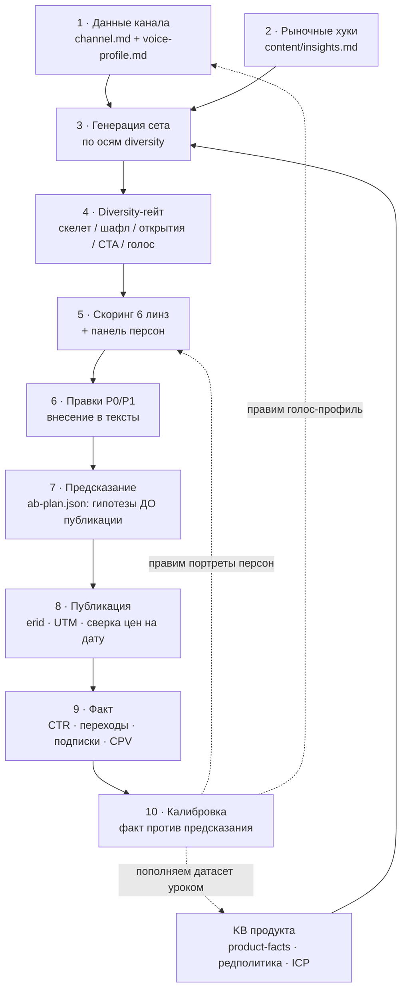

# Обвязка конвейера креативов: данные на входе, петля на выходе

> Цель: точнейшие креативы и нивелирование ошибок за счёт данных, а не чутья.
> Каждый шаг конвейера опирается на артефакт в репо. Чего нет в данных,
> того нет в креативе.
>
> **Операторский порядок работы (точка входа): [CREO-RUNBOOK.md](CREO-RUNBOOK.md)** —
> канал → рефы → оффер (согласование) → 5 текстов + картинки → скоринг → рекомендация.
> Эталон тона: `content/references/creo-gold-standard.md`. Этот файл — про движок данных.

## Схема

## Артефакты по шагам

| Шаг | Артефакт | Что содержит |
|---|---|---|
| 1 | `content/channels/<slug>/channel.md` | Аудитория, статистика (TGStat), оферта, форматы, табу |
| 1 | `content/channels/<slug>/voice-profile.md` | Голос автора из 5–7 реальных постов: лексика, ритм, фишки, чего не напишет |
| 2 | `content/insights.md` | Реестр рыночных хуков с датами и источниками (уход Notion, Jira и т.д.) |
| 3–6 | `content/channels/<slug>/sets/<set>/set.md` | Тексты вариантов + оси разнообразия + баллы + статус правок |
| 7, 9, 10 | `content/channels/<slug>/sets/<set>/ab-plan.json` | Предсказания до публикации, поля под факт, вывод калибровки |
| 5 | `public/scoring/*.html` | Пер-вариантные скоринг-отчёты |
| — | `docs/scoring-dataset.*` | Калибровочный корпус: реальные офферы конкурентов |

## Что заносить в данные (чтобы снимать ошибки)

Уже есть:
- **ICP — источник истины по ЦА: `content/references/icp-kaiten.md`** (14 сегментов × роли × боли × решение × метрики × кейсы). Шаг 0 любого сета — свериться с ICP, боли/пруфы брать дословно.
- продуктовые факты, редполитика (KB content_zavod)
- реальные офферы конкурентов (датасет)
- панель персон и правило разнообразия

**Занести — по убыванию ценности:**

1. **5–7 реальных постов каждого канала** → голос-профиль перестаёт быть
   гипотезой. Самый дешёвый способ поднять Craft и нативность.
2. **Факт по каждому вышедшему размещению** (CTR, переходы по UTM, подписки,
   стоимость) → без этого петля A/B не замыкается и панель персон не учится.
3. **Комментарии подписчиков канала** (20–30 под постами) → лексика аудитории
   для вопросов в FAQ и реплик в диалогах. Персоны начинают говорить как люди.
4. **Прошлые интеграции в канале** (чьи, как поданы, сколько реакций) →
   видно, какие жанры канал уже «сжёг» и что зашло у конкурентов.
5. **Статистика канала из TGStat** (охват поста, ER, динамика подписок,
   время выхода) → прогноз охвата в карточке считается из данных, не со слов
   продавца.
6. **Снапшоты страниц, на которые ведём** (лендинг kaiten-for-edit) →
   Claims-линза сверяет обещание поста с тем, что читатель реально увидит
   после клика. Разрыв «пост обещает — лендинг молчит» это отдельная ошибка.
7. **Даты сверки цен и лимитов** в каждом факте → защита от протухших цифр.

## Правила нивелирования ошибок

- **Ошибки Claims** ловятся источником: у каждого факта в посте есть ссылка
  на строку KB. Нет строки, значит это INF или RISK.
- **Ошибки тона** ловятся голос-профилем: черновик кладётся рядом с реальными
  постами, вслух.
- **Ошибки однообразия** ловятся diversity-гейтом до скоринга.
- **Ошибки прогноза** ловятся ab-plan: предсказание записано до публикации,
  задним числом не переписывается. Расхождение с фактом правит модель
  (портреты, веса), а не объяснение.
- **Ошибки протухания** ловятся датой: цены, лимиты, «сервис ушёл/вернулся»
  сверяются на дату публикации, не на дату написания.
