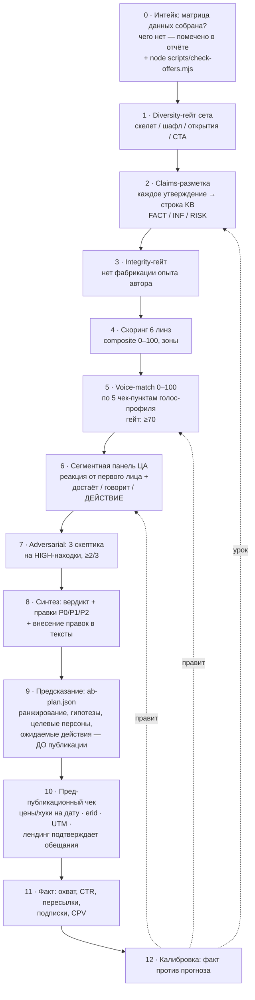

# Скоринг-пайплайн v2: данные → этапы → выходы

> Операционная спецификация прогона скоринга. Методология линз — в
> [SCORING.md](SCORING.md), обвязка всего конвейера — в [PIPELINE.md](PIPELINE.md).
> Здесь: какие данные закидываем на вход, через какие этапы идёт сет
> и что получаем на выходе — исходя из целей.

## Цели → выходы

| Цель | Выход пайплайна |
|---|---|
| Убрать вкусовщину и когнитивные искажения | Решение «какой вариант брать» с числовым обоснованием и реакциями персон |
| Точнейшие креативы | Список правок P0/P1/P2 + voice-вердикт + claims-разметка по строкам KB |
| Дата-драйвен A/B | ab-plan: ранжирование, гипотезы и целевые персоны, записанные до публикации |
| Нивелирование ошибок | Гейты (integrity, claims, voice, diversity) + калибровка после факта |
| Накопление знаний | Уроки в датасет, обновления портретов и голос-профилей |

## Матрица входных данных

| Слой | Артефакт | Что даёт скорингу | Без него |
|---|---|---|---|
| **Канал** | `content/channels/<slug>/channel.md` | Аудитория, оферта, табу, форматы | Persona-линза гадает |
| | `voice-profile.md` + `real-posts.md` | Тон автора для voice-match | Craft оценивает «красиво вообще», а не «родной канал» |
| | комментарии подписчиков (20–30) | Лексика аудитории для реплик персон | Персоны говорят как маркетологи |
| | TGStat: охват, ER, время выхода | База «достаёт» и прогноз охвата | Прогноз со слов продавца |
| | прошлые интеграции канала | Какие жанры канал «сжёг» | Риск повтора чужого захода |
| **Сегмент** | `content/segments/<segment>/panel.md` | Синтетическая панель ЦА сегмента | Оценка «средним читателем», которого не существует |
| | `content/segments/<segment>/competitors.json` | Конкуренты, с которыми сравнивает читатель ЭТОГО сегмента (для редакций — Notion-замены, для IT — трекеры), их офферы отскорены той же рубрикой → бенчмарк в отчёте | Бенчмарк против чужих конкурентов вводит в заблуждение |
| | **ICP (`content/references/icp-kaiten.md`) — ОБЯЗАТЕЛЬНО** | Сегменты × роли × 3 вида боли + решение Kaiten + ценность + метрики + реальные кейсы/статьи. **Шаг 0 любого сета:** определить задетые ICP-роли, боли/пруфы брать дословно | Боли из головы, мимо ЦА |
| **Продукт** | product-facts, редполитика (KB content_zavod) | Claims-линза, границы модулей | Обещания сверх продукта |
| | снапшот лендинга-цели | Сверка «пост обещает — лендинг подтверждает» | Разрыв после клика |
| **Рынок** | `content/insights.md` | Датированные хуки | Заходы через «вечные боли» слабее |
| | `docs/scoring-dataset.*` | Калибровка рубрики, уроки | Оценки плывут между прогонами |
| **Размещение** | карточка в спринте | Цена, дата, формат, оферта | CTA и экономика вслепую |

## Этапы прогона



### Этап 4½ · Дисциплина оценки: якоря, форс-ранжирование, разброс (v2.1)

Проблема, которую лечим: **компрессия баллов** — LLM-судья кластерит всё в 82–86,
и скоринг перестаёт различать варианты. Три правила:

1. **Якорный скоринг.** Перед выставлением баллов перечитать три якоря из
   `docs/scoring-dataset.md`: верх (~86, Света З1 «Куда переехать из Notion»),
   середина (~67, EvaTeam — факт есть, но тонет в «звоне»), низ (~56, Битрикс24 —
   всё обо всём). Каждый балл — это позиция ОТНОСИТЕЛЬНО якорей, не абсолют.
2. **Форс-ранжирование до баллов.** Сначала жёстко ранжировать варианты 1→5 по
   каждой линзе (без ничьих), только потом переводить в баллы. Ничья = не думал.
3. **Правило разброса.** В сете из 5 разница composite лучшего и худшего должна
   быть **≥ 5 баллов**. Меньше — пересмотр: либо варианты правда клоны (тогда
   их зарубит diversity-гейт), либо судья не различает — переранжировать.

### Этап 4¾ · Стоп-тест 3 секунд (перфоманс-критично)

Telegram показывает в свёрнутом виде и в пуше **~90 символов первой строки**.
Отдельная проверка каждого варианта: прочитать ТОЛЬКО первые 2 строки и ответить —
остановит ли скролл? Есть ли в них конкретика (цифра, имя, вопрос, конфликт)?
Первые строки из общих слов («Управление задачами — это важно») = автоматом P0-правка.
Результат стоп-теста входит в MMF-линзу с комментарием в отчёте.

### Этап 5 · Voice-match (новый)

Сопоставление с тоном автора канала по подтверждённому голос-профилю.
Пять чек-пунктов × 20 баллов:

1. **Регистр** — совпадает разговорность/формальность (у Светы: устная речь как есть)
2. **Ритм** — длина абзацев и предложений как в корпусе канала
3. **Приёмы** — использован хотя бы один фирменный приём канала (многоголосие, мета-юмор, скобочные пояснения…)
4. **Табу** — нет лексики, которую автор не пишет никогда (канцелярит, лозунги, менеджерский жаргон)
5. **Оформление** — эмодзи/списки/разделители в манере канала

Гейт: **Voice-match < 70 → пост возвращается на правку до выдачи.**
Балл не входит в composite (чтобы оценки оставались сравнимы с датасетом),
но фиксируется в отчёте отдельной секцией. Прецедент: З5 сета Светы после
voice-правки (многоголосие) вырос и по composite 79.5 → 82.2 — голос тянет
и Craft, и Persona.

### Этап 6 · Сегментная панель (новое)

Общая панель ([personas.md](personas.md)) отвечает «кто наш покупатель вообще».
Сегментная панель (`content/segments/<segment>/panel.md`) — «кто читает этот
канал». Собирается из ICP + реальных данных канала (комментарии, посты,
опросы аудитории) и для каждой персоны даёт:

- портрет и контекст (из данных, не из головы)
- реакцию от первого лица на конкретный пост
- **«достаёт»** (0–10, из тематики и статистики канала)
- **«говорит»** (0–10, попадание в боль)
- **«действие»** — поведенческий прогноз: пролистает · дочитает · лайкнет ·
  **перешлёт** · **кликнет** · сохранит · спросит в комментах

Поле «действие» — главное новое: клик и пересылка это разные воронки.
Пост-прогрев (З4 «непопулярное мнение») прогнозирует пересылки при слабом
клике, оффер-пост (З1) — наоборот. Прогноз действий сворачивается
в ab-plan и после публикации проверяется фактом.

**v2.1 · Распределение «на 100 читателей» (обязательное).** Качественные реплики
персон дополняются ЧИСЛЕННЫМ прогнозом на вариант-победитель:

```
из 100 увидевших: пролистают N · дочитают M · отреагируют R · перешлют F · кликнут C
```

Числа пишутся в ab-plan.json (`predictions.per100`) ДО публикации. После факта:
C сверяется с CTR, R и F — с реакциями/пересылками к охвату. Расхождение >2× —
сигнал править портреты панели, а не объяснять факт. Это единственный способ
сделать синтетическую панель ПРЕДСКАЗАТЕЛЬНОЙ моделью, а не театром реплик.

**v2.1 · Обязательные элементы панели сегмента:**
- каждая персона: роль (ЛПР/ЛВР/пользователь) · JTBD одной строкой · возражение №1 ·
  триггер действия · реплика живой лексикой (из комментариев канала, если есть);
- **одна анти-персона** — кто в аудитории канала НЕ купит никогда (студент без
  команды, фанат конкурента). Её реакция «мимо» на пост — норма, и она защищает
  от оптимизации текста под шум;
- при наличии 20+ комментариев из канала — реплики персон пишутся их лексикой.

### Этап 10 · Пред-публикационный чек (новый)

За сутки до выхода, чек-лист:
- [ ] Цены/лимиты в посте сверены на дату (не на дату написания)
- [ ] Хук из insights.md всё ещё активен (сервис не вернулся, дедлайн не сдвинулся)
- [ ] erid получен, UTM проставлена
- [ ] Лендинг-цель открыт и подтверждает каждое обещание поста
- [ ] Формат соответствует оферте (одна публикация, от чьего лица)

## Выход прогона (спека отчёта v2)

Пер-вариантный HTML-отчёт, секции по порядку:

1. Вердикт: composite, зона, TL;DR
2. Скоринг по 6 линзам с обоснованиями
3. **Voice-match: балл, чек-пункты, вердикт «родной / выпадает»**
4. Текст с разметкой FACT/INF/RISK (каждый FACT — со ссылкой на строку KB)
5. **Сегментная панель: реакции, достаёт/говорит/действие**
6. Риски после adversarial + отклонённые претензии
7. План правок P0/P1/P2
8. Методология и источники

Плюс на сет: `set.md` (карта осей + тексты), `ab-plan.json` (прогнозы),
обновление датасета при новом уроке.

## Definition of Done прогона

Сет считается прогнанным, когда: все гейты пройдены или падения объяснены ·
P0 внесены в тексты · ab-plan заполнен до публикации · чего не хватало
в данных — записано в чек-лист канала (`channel.md`).
