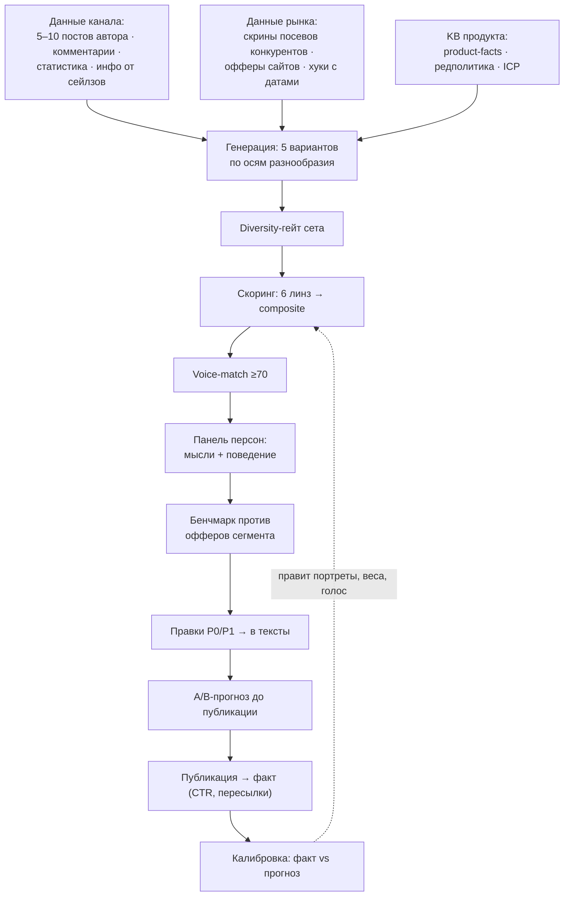
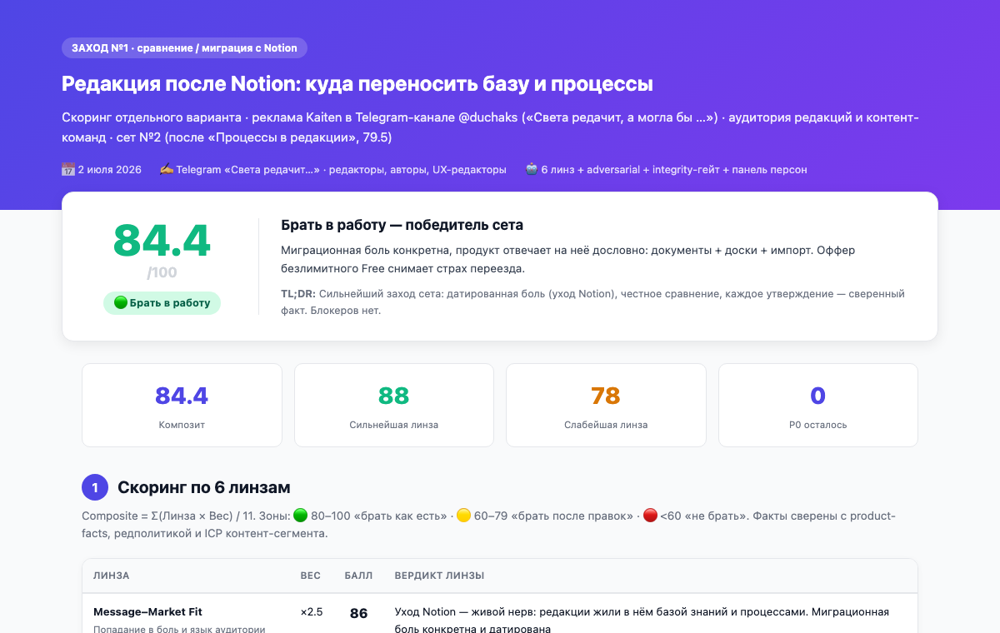
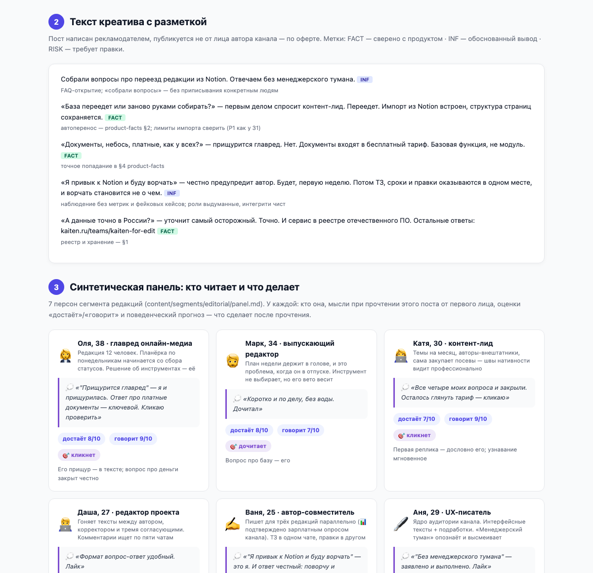
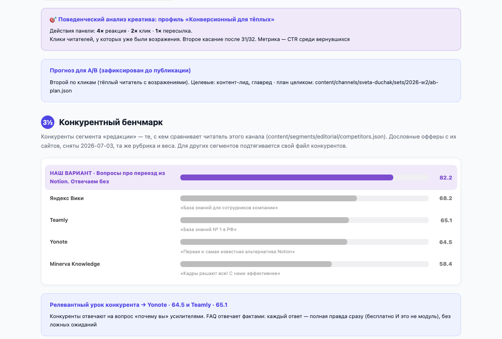

# Мой алгоритм скоринга креативов: как устроен и как я его обучала

> Полное описание системы скоринга рекламных креативов
> в Kaiten Influence — что это, как считает, откуда берёт «истину» и, главное,
> как я её настраивала и калибровала. Все цифры и примеры — из реальных
> скоринг-отчётов проекта (`public/scoring/*.html`).

---

## 1. Зачем это вообще

До скоринга выбор креатива выглядел так: «мне нравится» / «а мне нет» — и спор
ни о чём. Скоринг заменяет вкусовщину на измеримое решение: каждый вариант поста
получает балл 0–100, разбор по критериям и список правок с приоритетами.
Спор «нравится/не нравится» превращается в разговор «вот линза, вот балл, вот почему».

Оценку выполняет агент по формализованной рубрике, сверяясь с базой знаний
о продукте, бренде и аудитории.
Обучение здесь — это итеративная настройка рубрики, весов и базы знаний
на реальных креативах, с разметкой и сверкой с моим собственным суждением.
Процесс обучения — в разделе 6.

---

## 2. Место в конвейере креативов

Полная схема прогона — от данных до калибровки:



Скоринг — второй шаг конвейера, и порядок принципиален:

1. **Генерация.** Агент пишет **5 вариантов** поста («заходов») под конкретный
   канал: его тон, жанр, аудиторию. Не один, а пять — чтобы было из чего выбирать.
   Варианты обязаны быть разными по углу, жанру, фокусу и структуре —
   правило и чек-тесты: [creative-diversity.md](creative-diversity.md).
1½. **Diversity-гейт сета.** До скоринга сет проверяется на разнообразие
   (скелет-тест, шафл-тест, тест открытий и CTA). Пять постов одного скелета
   на скоринг не подаются — A/B из пяти одинаковых постов ничему не учит.
2. **Скоринг.** Каждый вариант прогоняется через алгоритм и получает балл.
   Баллы видны прямо в карточке размещения (мини-дашборд).
3. **Визуал.** Только вариант-победитель получает картинку в фирменном стиле.
   Логика: зачем рисовать картинку к тексту, который не прошёл отбор.
4. **Отчёт.** Каждый скоринг — не просто цифра, а HTML-страница-отчёт,
   которую можно показать блогеру или руководителю без моих пояснений.

---

## 3. Формула: 6 линз

Каждый креатив оценивается по шести «линзам» — углам зрения. У каждой линзы
свой вес: попадание в боль аудитории важнее, чем красота текста.

| Линза | Вес | Что меряет |
|---|---|---|
| **Message–Market Fit** | ×2.5 | Попадает ли пост в реальную боль аудитории, говорит ли на её языке |
| **Persona / ICP Fit** | ×2 | Кого реально достаёт канал и говорит ли пост именно с ним |
| **Objections & Positioning** | ×2 | Баланс «реклама × нативность», соответствие канону бренда |
| **Claims Accuracy & Risk** | ×2 | Фактическая точность каждого утверждения, юридические риски и риски доверия |
| **Channel & Funnel / CTA** | ×1.5 | Подходит ли канал, понятен ли следующий шаг (оффер, лендинг, UTM) |
| **Creative & Copy Craft** | ×1 | Голос автора, структура, подача |

Механика подсчёта:

- каждая линза = **4–5 sub-критериев**, каждый оценивается **0–10 × вес** → балл линзы 0–100;
- **Composite = Σ(Линза × Вес) / Σ(Вес)**, где Σ вес = 11;
- итог — балл 0–100 и зона решения.

### Зоны решения

| Зона | Балл | Решение |
|---|---|---|
| 🟢 Зелёная | 80–100 | Брать как есть |
| 🟡 Жёлтая | 60–79 | Брать после правок |
| 🔴 Красная | < 60 | Не брать |

Простое, читаемое правило — его понимает и продюсер, и блогер, и руководитель.

Так выглядит вердикт в живом отчёте (скрин с платформы, победитель сета Светы):



### Живой пример: последний сет «Светы редачит»

Полный прогон одного сета — пять вариантов, пять жанров, пять отчётов
на проде. Это последняя версия отчёта (v2): линзы, voice-match, панель
персон с поведением, бенчмарк сегмента, A/B-прогноз.

| Вариант | Жанр | Composite | Voice | Отчёт |
|---|---|---|---|---|
| З1 «после Notion» | сцена-оффер | **84.4** 🏆 | 78 | [открыть](https://kaiten-influence.vercel.app/scoring/2026-week2-sveta-z1-notion.html) |
| З2 «переписка в чате» | переписка / диалог | 81.8 | 90 | [открыть](https://kaiten-influence.vercel.app/scoring/2026-week2-sveta-z2-chat.html) |
| З3 «проверь редакцию» | тест из вопросов | 81.3 | 88 | [открыть](https://kaiten-influence.vercel.app/scoring/2026-week2-sveta-z3-test.html) |
| З4 «непопулярное мнение» | мнение-провокация | 80.5 | 84 | [открыть](https://kaiten-influence.vercel.app/scoring/2026-week2-sveta-z4-opinion.html) |
| З5 «FAQ из комментов» | FAQ | 82.2 | 88 | [открыть](https://kaiten-influence.vercel.app/scoring/2026-week2-sveta-z5-faq.html) |

Весь сет в зелёной зоне, но выбор всё равно нетривиален: победитель З1
силён оффером при самом низком voice-балле, а З2 — наоборот, самый
«родной» по голосу. Такие развилки и решает связка «composite + панель
персон + цель размещения», а не одна цифра. Жанры вариантов не
повторяются — это требование [правила разнообразия](creative-diversity.md).

### Больше примеров отчётов (все на проде)

Сет «Деплой ботанов» (YouTube, разработка):
[честный обзор 80/20](https://kaiten-influence.vercel.app/scoring/2026-week1-deploy-z1-review-80-20.html) ·
[зоопарк инструментов](https://kaiten-influence.vercel.app/scoring/2026-week1-deploy-z2-zoo.html) ·
[трекер, который дружит с кодом](https://kaiten-influence.vercel.app/scoring/2026-week1-deploy-z3-code.html) ·
[метрики потока](https://kaiten-influence.vercel.app/scoring/2026-week1-deploy-z4-flow-metrics.html) ·
[настройка без программистов](https://kaiten-influence.vercel.app/scoring/2026-week1-deploy-z5-no-code-setup.html)

Сет «Пименов вещает» (TG, менеджмент разработки):
[эффективность потока](https://kaiten-influence.vercel.app/scoring/2026-week1-pimenov-z1-flow-efficiency.html) ·
[процентили вместо обещаний](https://kaiten-influence.vercel.app/scoring/2026-week1-pimenov-z2-percentiles.html) ·
[закон Литтла](https://kaiten-influence.vercel.app/scoring/2026-week1-pimenov-z3-littles-law.html) ·
[накопительная диаграмма](https://kaiten-influence.vercel.app/scoring/2026-week1-pimenov-z4-cfd.html) ·
[экономика завершения](https://kaiten-influence.vercel.app/scoring/2026-week1-pimenov-z5-cost-of-delay.html) ·
плюс [скоринг всей интеграции «важность метрик»](https://kaiten-influence.vercel.app/scoring/2026-week1-pimenov-metrics.html)

Исторический: [первый скоринг Светы](https://kaiten-influence.vercel.app/scoring/2026-week1-sveta-editorial.html) —
тот самый отчёт 79.5 с пойманным риском про платный модуль (разбор в разделе 7).
Формат отчёта там ещё v1 — по разнице с сетом выше видно, как система выросла.

---

## 4. Надстройки над формулой

Балл сам по себе — полдела. Вокруг формулы четыре механизма, которые делают
оценку доказуемой, а не декларативной.

### 4.1. Разметка утверждений: FACT / INFERENCE / RISK

Текст креатива размечается по предложениям:

- **FACT** — утверждение сверено с продуктовыми фактами (доски, колонки, метки — есть);
- **INFERENCE** — обоснованный вывод (боль «нет единой картины потока» типична для сегмента);
- **RISK** — утверждение, создающее ложное ожидание или юридический риск.

Именно эта разметка ловит то, что глазами не видно (пример — в разделе 7).

Той же разметкой я прогоняю **чужие креативы и офферы**: каждый рекламный
пост конкурента, попавший в базу, размечается по предложениям и скорится
той же рубрикой. Так корпус для калибровки и бенчмарк собираются в одной
системе координат с нашими постами.

### 4.2. Adversarial-верификация: 3 скептика

Каждая находка с severity=HIGH проверяется тремя «скептиками» — отдельными
прогонами с мандатом **«опровергни»**. Находка подтверждается при согласии **≥ 2/3**.
Отклонённые претензии тоже попадают в отчёт с объяснением, почему сняты, — чтобы
одни и те же споры не поднимались заново («эмодзи несерьёзно» — 0/3, это стиль канала).

### 4.3. Integrity-гейт

Жёсткое правило поверх всего: **запрет приписывать автору канала опыт, внедрение
и метрики, которых не было**. Пост по оферте пишется рекламодателем — значит,
никакой фабрикации «личного кейса» блогера. Нарушение — блокер вне зависимости от балла.

### 4.4. Синтетическая панель ЦА и матрица «персона × пост»

Пост «читает» панель из 8 синтетических персон — портреты собраны из ICP
и реальных комментариев каналов: тимлид с наследием Jira, гендиректор агентства,
разработчик-скептик, главред, опердир производства, маркетолог, «скептик
с таблицей» (стресс-тест) и фрилансер-антипрофиль (детектор промаха).
Каждая персона даёт **реакцию от первого лица** — что увидела в ленте, где
остановилась, где закрыла — и две оценки по шкале 0–10:

- **«Достаёт»** — вероятность, что персона вообще есть в аудитории канала;
- **«Говорит»** — насколько пост бьёт в её боль.

Матрица показывает, на ком именно проседает креатив. Пример: у «Светы редачит»
автор/копирайтер — «достаёт 9, говорит 5»: в аудитории его много, но пост говорит
с ролью «управляю потоком». Именно это удержало Persona-линзу на 78.

Цели панели: **убрать когнитивные искажения** (судит не автор своими глазами,
а процедура чужими) и **сделать A/B-тесты дата-driven** — предсказание панели
фиксируется до публикации, сверяется с фактом (CTR, UTM) после, расхождение
правит портреты. Портреты целиком: **[personas.md](personas.md)**.

Поверх общей панели работают **сегментные панели** (`content/segments/<segment>/panel.md`) —
портреты читателей конкретного типа каналов, собранные из ICP и реальных
данных канала (посты, комментарии, опросы аудитории). Вот как персона
устроена целиком и что она отдаёт в отчёт:

- **Портрет**: эмодзи, имя, возраст, род деятельности, контекст из данных
  (пример: «✍️ Ваня, 25 — автор-совместитель, пишет для трёх редакций
  параллельно» — совместительство подтверждено реальным зарплатным опросом
  канала, не придумано);
- **Триггеры**: на что останавливается в ленте, что закрывает со второй строки;
- **Мысли при прочтении** — внутренний монолог от первого лица на конкретный
  пост, написанный лексикой корпуса канала: «"Прищурится главред" — я и
  прищурилась. Кликаю проверить»;
- **Оценки**: «достаёт» (0–10, есть ли персона в аудитории канала — из
  тематики и статистики) и «говорит» (0–10, попадание в её боль);
- **Поведенческий прогноз**: что сделает после прочтения — пролистает ·
  дочитает · лайкнет · **перешлёт** · **кликнет** · сохранит · спросит
  в комментах. Клик и пересылка — разные воронки.

Действия панели сворачиваются в **поведенческий профиль креатива**:

| Профиль | Паттерн действий | Роль в закупке |
|---|---|---|
| Конверсионный | клики ЛПР | первое касание, метрика CTR |
| Виральный | пересылки большинства персон | дешёвый охват, метрика пересылок |
| Вовлекающий | ответы, сохранения, отложенные клики | греет и сегментирует |
| Прогрев / доверие | пересылки при минимуме кликов | не ставить первым |

Две специальные персоны в каждой панели: **скептик** («у нас и так таблица») —
гейт MMF: пост, не отвечающий на его возражение, не проходит никого;
и **антипрофиль** (фрилансер-одиночка) — детектор промаха: резонанс у него
при тишине у остальных значит, что канал или заход выбраны мимо ICP.

Так панель выглядит в отчёте — карточки с мыслями и поведением (скрин
с платформы, заход «FAQ многоголосием»):



А так — поведенческий профиль креатива и бенчмарк против офферов сегмента:



Операционный пайплайн прогона со всеми этапами и гейтами:
**[SCORING-PIPELINE.md](SCORING-PIPELINE.md)**.

### 4.5. Выход: план правок P0 / P1 / P2

Каждый отчёт заканчивается планом:

- **P0** — правка, снимающая зону/блокер (обязательна перед публикацией);
- **P1** — усиление (подтянуть просевшую персону);
- **P2** — полировка (обложка, маркировка/ERID).

---

## 5. База знаний: откуда берётся «истина»

Скоринг настолько хорош, насколько хороша база, с которой сверяются утверждения.
Каждая линза читает релевантные файлы KB (живут в репозитории `content_zavod`):

| Источник | Что даёт |
|---|---|
| `ICP Kaiten.xlsx` | Сегменты × роли × боли — сырьё для Persona/ICP Fit и Message–Market Fit |
| `wiki/audiences/icp-overview.md` | Портреты ЛПР, приоритетные сегменты и user stories |
| `wiki/references/kaiten-product-facts.md` | Продуктовые факты: что есть, что платный модуль, лимиты тарифов |
| `wiki/brand/kaiten-brand-platform.md` | Канон бренда, позиционирование («единая рабочая среда») |
| `wiki/kaiten-roadmap-2026.md` | Публичный роадмап — чтобы «хотелки» в честных обзорах были реальными |
| `wiki/references/anglicism-dictionary.md` | Словарь допустимых/недопустимых англицизмов |
| Оферта канала | Формат публикации, кто маркирует, от чьего лица пост |

Принцип: **каждое утверждение в посте должно быть сверяемо с файлом**. Если
источника нет — это INFERENCE или RISK, не FACT.

---

## 5½. Что я гружу в агента руками (пока)

Часть данных не достаётся автоматикой — их я заношу вручную, и это
осознанная цена за то, чтобы система работала на реальном материале
уже сейчас.

### Скрины рекламных креативов конкурентов

Посевы конкурентов в Telegram-каналах — **динамические**: выходят, живут
день-два в ленте и удаляются по договору или уезжают вниз. Парсером сайтов
их не достать, вчерашний пост завтра не существует. Поэтому я ловлю их
руками: вижу рекламу трекера или базы знаний в канале — **скриню и гружу
скрин в агента**. Агент распознаёт текст, размечает по предложениям
(FACT/INF/RISK), скорит той же рубрикой и заносит в базу с датой, каналом
и жанром. Так собирается корпус живых посевов рынка, а не только
парадных офферов с сайтов.

### Реальные посты автора канала

Перед каждым сетом я гружу в агента **5–10 реальных постов канала** —
просто пересылаю текстом. Из них агент строит голос-профиль: регистр,
ритм, фирменные приёмы, табу-лексика (пример: `content/channels/
sveta-duchak/voice-profile.md` — 8 приёмов Светы с цитатами, включая
многоголосие и мета-юмор). Без этого корпуса voice-match работает
по черновым гипотезам и честно это помечает в отчёте.

### Комментарии подписчиков и опросы аудитории

Лексика реальных читателей — сырьё для реплик персон. Пример уже в деле:
персона «автор-совместитель» построена на зарплатном опросе канала Светы
(там прямо виден рост доли совместителей). Комментарии заношу по мере
сбора — 20–30 под постами канала достаточно.

### Инфо от сейлзов и других команд Кайтена — вносить можно и нужно

Система всеядна к полевым данным: любой, кто разговаривает с клиентами,
может обогатить модель. Что особенно ценно:

- **Возражения из звонков** («а чем вы лучше X», «у нас безопасники
  против облака») → питают Objections-линзу и реплики скептика;
- **Причины проигранных сделок** → антипаттерны для креативов: о чём
  нельзя умалчивать в посте, чтобы лид не отвалился позже;
- **Вопросы с демо** → готовые вопросы для FAQ-жанра лексикой реальных
  клиентов, а не выдуманные;
- **Слова, которыми клиенты называют продукт и боль** → Message–Market Fit
  перестаёт гадать про язык аудитории;
- **От саппорта**: за какими функциями приходят и на что жалуются →
  границы обещаний для Claims-линзы.

Механика простая: скинуть текстом/скрином агенту → разметка → нужный
файл базы (панель сегмента, insights, product-facts-заметки). Правило
то же, что для всего корпуса: данные с датой и источником.

### Что из этого автоматизирует парсер

План (спека — [HOW-IT-WORKS.md](HOW-IT-WORKS.md)): парсер не только сайтов.

1. **Офферы сайтов** — headless Chrome, снапшоты по датам, дифф, history
   чужого позиционирования (P1).
2. **Посевы в каналах** — мониторинг рекламных постов конкурентов через
   каналы и агрегаторы (TGStat и подобные): лента чужих размещений перестаёт
   зависеть от того, успела ли я скринить (P2).
3. **Статистика каналов** — охваты и ER из TGStat API вместо слов продавца (P2).
4. **Факт наших размещений** — автосбор по UTM в ab-plan (P3).

Разметка и скоринг остаются за агентом при любой автоматизации: парсер
приносит материал, суждение выносит рубрика.

---

## 6. Как я это обучала: процесс калибровки

Самая частая иллюзия — что рубрику можно написать один раз из головы. Нельзя.
Моя рубрика прошла несколько итераций на реальных креативах, и каждая итерация
видна в истории коммитов проекта. До этого рубрика тренировалась на корпусе
**реальных офферов конкурентов** — дословные формулировки с сайтов YouGile,
Битрикс24, Яндекс Трекера и Shtab, размеченные и оценённые:
**[scoring-dataset.md](scoring-dataset.md)** (каждый пример — с источником,
разметкой, баллами и уроком, который он дал рубрике; машиночитаемо —
[scoring-dataset.json](scoring-dataset.json)). Параллельно я грузила в агента
**скрины живых рекламных посевов конкурентов** из Telegram-каналов — они
динамические и удаляются, поэтому ловятся только руками в моменте
(механика — раздел 5½). Вот как это было по шагам.

### Шаг 1. Загрузила корпус креативов

Первый рабочий сет — 5 заходов для канала «Пименов вещает» (Алексей Пименов,
канбан-метод): эффективность потока, перцентили, закон Литтла, накопительная
диаграмма, цена задержки. Пять реальных постов под реальный канал с реальной
аудиторией — не синтетика.

### Шаг 2. Сформулировала критерии из своих же решений

Я смотрела, **по каким причинам я сама** принимаю или заворачиваю креативы,
и превращала эти причины в линзы:

- заворачиваю «не про нашу аудиторию» → линзы Message–Market Fit и Persona/ICP Fit;
- заворачиваю «слишком рекламно, блогер так не пишет» → Objections & Positioning;
- заворачиваю «обещаем то, чего нет в тарифе» → Claims Accuracy & Risk;
- заворачиваю «непонятно, куда жать» → Channel & Funnel / CTA;
- «просто слабый текст» — важно, но реже всего решает → Creative Craft с весом ×1.

Веса назначала по той же логике: **попадание в боль (×2.5) важнее красоты
текста (×1)** — потому что красивый текст мимо боли не продаёт, а корявый
текст в боль — работает.

### Шаг 3. Разметила утверждения и прогнала первый скоринг

Каждый пост разметила по предложениям: что здесь FACT (сверяется с product-facts),
что INFERENCE, что RISK. Первый прогон дал агрегированный отчёт по 5 заходам
с победителем (№4 «Накопительная диаграмма», 82.5).

### Шаг 4. Сверила баллы со своим суждением — и раздробила скоринг

Агрегированный отчёт оказался слишком грубым: чтобы спорить о варианте, нужен
разбор именно этого варианта. Переделала на **пер-вариантные скоринги** — отдельная
страница-отчёт на каждый из 5 заходов, потом добавила числовые баллы по всем
вариантам (80 / 79.1 / 78.3 / 82.5 / 79) и мини-дашборд скоринга в карточку.
Проверка калибровки: порядок баллов совпал с моим ранжированием «на глаз»,
но баллы дали то, чего глаз не даёт, — **обоснование разрыва** между вариантами.

### Шаг 5. Поймала системную ошибку — и перекалибровала источник болей

Сет для канала «Деплой» (YouTube, разработчики) первой версией зашёл через тему
«замена Jira». Сверка с `ICP Kaiten.xlsx` показала: боли реальной аудитории —
другие (единый контур, гибкость без программистов, аналитика потока, связь с кодом,
суверенитет). **Весь сет переделан**: 5 новых заходов, боли взяты строго из ICP,
формат «честный обзор 80/20», где «20% хотелок» сверены с публичным роадмапом.
Победитель — 83.3.

Урок калибровки: линза Persona/ICP Fit работает только если боли приходят
из размеченного источника (ICP), а не из «общих представлений об аудитории».
После этого случая ICP стал обязательным входом скоринга.

### Шаг 6. Добавила adversarial-слой и integrity-гейт

Ранние прогоны иногда давали находки-паникёрства («слишком продуктово!»,
«эмодзи несерьёзно!»). Лечение — три скептика с мандатом «опровергни» на каждую
HIGH-находку: подтверждается при ≥2/3, отклонённые претензии фиксируются в отчёте
с причиной. Отдельно — integrity-гейт после кейсов, где креатив «от лица автора»
рисковал приписать блогеру внедрение, которого не было.

### Шаг 7. Проверила на новом домене

Финальная проверка обученной рубрики — креатив для «Света редачит» (аудитория
редакций, совсем другой домен: не разработка). Рубрика перенеслась без правок
и сразу поймала неочевидный риск (см. раздел 7). Это и был критерий «обучено»:
**система ловит то, что я глазами не поймала, в домене, на котором не калибровалась**.

### На каких данных обучен каждый слой модели

Итог обучения удобно видеть как слои, каждый из которых калиброван
своим корпусом данных — и продолжает докалибровываться:

| Слой модели | Обучен на | Продолжает учиться на |
|---|---|---|
| Рубрика (6 линз, sub-критерии) | мои решения «беру/заворачиваю» по реальным креативам | расхождения баллов с решением команды |
| Веса линз (×2.5…×1) | разбор, что реально решает судьбу поста (боль > красота) | те же расхождения |
| Разметка FACT/INF/RISK | product-facts + кейсы ложных ожиданий (Битрикс «правда по частям», «Света» про модуль) | новые пойманные RISK |
| Калибровочный корпус | 12 реальных офферов конкурентов + скрины живых посевов | каждый новый оффер и посев |
| Панель персон | ICP (сегменты × роли × боли) + опросы канала + комментарии | факты размещений (чьё предсказание не сбылось — тот портрет правится) |
| Поведенческие прогнозы | логика воронок (клик ≠ пересылка) | CTR/пересылки/сохранения реальных постов |
| Голос-профили | 5–10 реальных постов каждого автора | новые посты канала, реакция автора на наши тексты |
| Уроки жанров | скоринги наших сетов (80/20 у «Деплоя», многоголосие у «Светы») | каждый новый сет |

### Итоговый цикл обучения (повторяемый)

```
креативы → разметка FACT/INF/RISK → скоринг по рубрике
   ↑                                        ↓
корректировка линз/весов/KB  ←  сверка с моим суждением и фидбеком команды
```

Каждый новый канал/домен — потенциальная итерация: если баллы расходятся
с решением команды, правится не решение, а рубрика или база знаний.

---

## 7. Контрольный кейс: что скоринг поймал

Пост для «Света редачит» получил **79.5** — жёлтая зона, одна правка P0.

Фраза «можно анализировать процессы» звучала так, будто аналитика входит
в базовый тариф. По факту отчёты в Кайтене — **отдельный платный модуль**
(в триале открыт 14 дней). Риск: читатель приходит за функцией, которой
в бесплатной версии нет, и уходит разочарованным. Лечится одной честной
оговоркой — и пост переходит в зелёную зону.

Ключевое: **глазами это не ловится** — текст звучит отлично. Ловится только
когда каждое утверждение сверяется с product-facts. Ровно для этого линза
Claims Accuracy и существует с весом ×2.

---

## 7½. Аутпут и импакт для Кайтена

### Что выдаёт каждый прогон

1. **Решение** — какой из 5 вариантов брать, числом и зоной, а не вкусом.
2. **Список правок P0/P1/P2** — уже внесённых в тексты до передачи.
3. **HTML-отчёт**, который можно отправить блогеру или руководителю без
   пояснений: вердикт, линзы, voice-match, панель с мыслями персон,
   бенчмарк, риски со снятыми претензиями скептиков.
4. **A/B-прогноз** — ранжирование, гипотезы и целевые персоны, записанные
   до публикации: после выхода поста сверяем и правим модель.
5. **Пополнение базы** — каждый прогон оставляет уроки в датасете,
   и следующий сет начинается не с нуля.

### Импакт для Кайтена

- **Деньги.** Бюджет размещения защищён выбором из 5 вариантов по данным:
  закупка у «Уставшего техдира» стоит 50 000 ₽ — цена одной ошибки в выборе
  захода сопоставима с месяцем работы всего пайплайна. Поведенческие профили
  (конверсионный/прогревный) подсказывают и порядок постов в закупке.
- **Репутация бренда.** Integrity-гейт и Claims-линза дают то, что нельзя
  купить постфактум: ни одного поста с фабрикацией опыта блогера или ложным
  обещанием («аналитика в бесплатном тарифе»). Пойманная до публикации
  оговорка стоит ноль, после — стоит доверия аудитории канала.
- **Позиция на рынке.** Бенчмарк из 12 реальных офферов показал: ни один
  конкурент не в зелёной зоне (максимум 77.5), наши посты — 80.5–84.4.
  Побочный продукт скоринга — живая карта слабостей чужого позиционирования
  (усилители без источника у 7 из 12), готовая для продукта и маркетинга.
- **Скорость и масштаб.** Сет из 5 вариантов со скорингом — часы, не дни.
  Процесс воспроизводим на каждый из 169 блогеров бэклога: папка канала,
  панель сегмента, прогон. Знание не уходит с человеком — оно в репо.
- **Знание аудитории накапливается.** Каждое размещение калибрует персон,
  каждый скрин посева пополняет корпус, каждый разговор сейлза может стать
  репликой скептика. Система дорожает с каждым циклом — в отличие от
  разовых закупок «по ощущениям».

## 8. Как это живёт в продукте

- Скоринги хранятся в карточке размещения: `creatives[].scoring` (HTML в Supabase
  Storage) + `creatives[].score` (число для бейджа).
- В карточке — мини-дашборд: баллы всех вариантов рядом, победитель виден сразу.
- Отчёт скачивается кнопкой прямо с карточки — самодостаточный HTML,
  который можно отправить блогеру или руководителю.
- Прогон скоринга — задача агенту обычными словами: «посчитай скоринг под
  аудиторию редакций» — агент читает KB, применяет рубрику, кладёт отчёт
  и балл в карточку.

## 9. Скоринги первого спринта (реестр)

| Канал | Вариантов | Победитель | Балл |
|---|---|---|---|
| «Пименов вещает» (TG, канбан-метод) | 5 | №4 «Накопительная диаграмма» | 82.5 |
| «Деплой» (YouTube, разработка) | 5 (сет переделан по ICP) | №1 «Честный обзор 80/20» | 83.3 |
| «Света редачит» (TG, редактуры) | 1 | «Процессы в редакции» | 79.5 → зелёная после P0 |

Все отчёты: `public/scoring/2026-week1-*.html`, на проде — `/scoring/...`.
